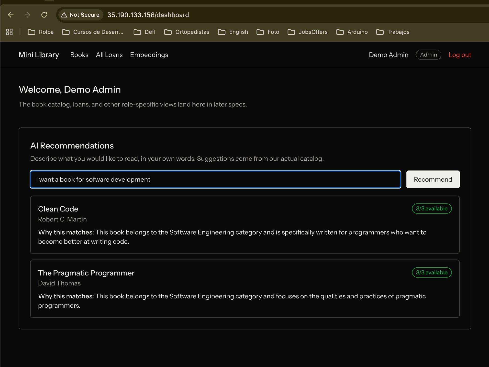

# Mini Library

A library management system (Laravel + Inertia/React) for cataloging books, tracking
checkouts, and searching the collection.

**The centerpiece is AI-powered, natural-language book recommendations** — members
describe what they want to read in their own words and get real suggestions pulled
from the actual catalog, each with a plain-English explanation of why it matches.
Everything else in the app (catalog, roles, checkout, inventory) exists to give that
feature a real, trustworthy collection to recommend from.

**Live deployment**: http://35.190.133.156/ — deployed automatically via the CI/CD
pipeline described in `DEPLOYMENT.md` on every push to `main`.

## AI Recommendations

Instead of only exact keyword search, a member can describe what they're looking for
in plain natural language (e.g. _"I want to read a book for software engineering"_)
and get relevant picks back, each with a short explanation of why it matches.



**Grounded, not generative** — the AI never invents a book. Every recommendation is
retrieved from the library's real catalog first (via a vector similarity search over
each book's title/author/category/description), and only then does the AI explain why
that specific, real book matches the query. If nothing in the catalog is relevant, the
member sees "no matches found" rather than a made-up suggestion. Availability shown on
each recommendation is always the book's live copy count, never a stale value.

Admins have a dedicated view into this pipeline (`/admin/embeddings`) showing every
book's embedding status, letting them retry a failed one or regenerate it on demand —
so the recommendation engine's data quality is inspectable, not a black box.

## Roles

Every account has exactly one role, enforced on both the UI and the server (not just
hidden buttons):

- **Member** — browse/search the catalog, get AI recommendations, check out and
  return books, view their own loan history.
- **Librarian** — everything a Member can do, plus manage the book catalog (add/edit/
  remove books), adjust inventory counts, and view/manage all members' loans
  (including returning a book on a member's behalf, e.g. at the front desk).
- **Admin** — everything a Librarian can do, plus the embedding-pipeline admin view
  (`/admin/embeddings`) that powers AI Recommendations.

## Inventory integrity

Every book tracks `total_copies` and `available_copies`. The system guarantees —
at both the application layer and, on Postgres, a database-level constraint as a last
line of defense — that available copies can never go negative or exceed the total,
even under concurrent activity (e.g. two people trying to check out the last copy at
the same time, or a librarian adjusting stock while a checkout is in flight). Only one
such request can ever win; the other gets a clear, honest error instead of corrupting
the count.

Librarians can add or remove physical copies via a dedicated "Adjust Inventory"
action. Removing copies is blocked if it would drop availability below the number
currently on loan — the system tells them exactly how many copies need to come back
first, rather than allowing an inconsistent state.

### How the concurrency guarantee actually works

The obvious way to write "decrement available copies, but not below zero" is to read
the current count, check it in PHP, then write the new value back. That's also the
classic way to get it wrong: two requests can both read "1 copy left" a millisecond
apart, both decide it's safe, and both succeed — leaving `available_copies` at -1.

Instead, every checkout, return, and inventory adjustment issues a single database
statement that does the check and the write **atomically**, in one round trip:

```sql
UPDATE books
SET available_copies = available_copies - 1
WHERE id = ? AND available_copies > 0
```

The database itself is what refuses a second concurrent request the moment the count
hits zero — not application code reacting a beat too late. If the `UPDATE` affects zero
rows, the code knows immediately that it lost the race and returns a clear "no longer
available" error instead of silently corrupting the count. Under N simultaneous
checkout attempts on the last copy, exactly one succeeds — every time, not "almost
always."

This also had to work identically on both databases the project uses: Postgres in
production, and SQLite for the fast local test suite. Row-locking approaches
(`SELECT ... FOR UPDATE`) exist in Postgres but are silently ignored by SQLite, which
would make the concurrency tests pass locally for the wrong reason — a false sense of
safety. The guarded-`UPDATE` pattern above needs no row locks at all, so it's genuinely
race-safe on both, and the same automated tests that catch a regression locally are
proving the real thing.

As a last line of defense, Postgres also enforces the invariant at the schema level
(a `CHECK` constraint), so even a future bug in application code couldn't write an
invalid value — the database itself would reject it.

## Local setup

Requires Docker and Docker Compose. No local PHP/Node/Postgres install needed — the
whole stack runs in containers.

```bash
git clone <this repo>
cd mini-library
cp .env.example .env
```

Fill in `.env`:

- `DB_DATABASE`, `DB_USERNAME`, `DB_PASSWORD` — any values work locally (e.g.
  `library` / `library` / a password of your choice); they're used to provision the
  local Postgres container and must match what the app connects with.
- `LLM_API_KEY` — a Gemini API key (see below). Required for search ranking, AI
  recommendations, and the embedding pipeline; the app still runs without it, but
  those features won't work.

Then bring the stack up:

```bash
docker compose up -d --build
docker compose exec app php artisan migrate
docker compose exec app php artisan db:seed
```

- App: http://localhost:8000
- Vite dev server (HMR): http://localhost:5173

`db:seed` creates 3 demo accounts (`admin@library.test`, `librarian@library.test`,
`member@library.test`, all password `password`) and a real 20-book catalog (see
`database/data/real_books.json`). Log in at `/login` — a one-click demo-login panel is
shown when `DEMO_LOGIN_ENABLED=true` (the local default).

Seeding a fresh book automatically dispatches an embedding job to the `queue`
container; give it a few seconds after seeding before search ranking/recommendations
reflect the full catalog.

### Getting a Gemini API key (for local use)

The AI features (embeddings, search ranking, recommendations) call Gemini through its
OpenAI-compatible endpoint.

1. Go to [Google AI Studio](https://aistudio.google.com/app/apikey).
2. Sign in with a Google account and click **Create API key**.
3. Copy the key into `.env` as `LLM_API_KEY`.

`.env.example` already has the matching provider settings:

```
LLM_BASE_URL=https://generativelanguage.googleapis.com/v1beta/openai
CHAT_MODEL=gemini-3.6-flash
EMBEDDING_MODEL=gemini-embedding-001
VECTOR_DIM=1536
```

This is a personal API key tied to your Google account — free-tier quota is enough for
local development, but don't commit it or share it outside your own `.env` (which is
gitignored). See `needed_variable.md` for the full list of variables this project
needs and why.

## More docs

- `docs/specs/` — the full set of specs this project was built from.
- `DEPLOYMENT.md` — production build, manual deploy runbook, and the automated CD
  pipeline.
- `needed_variable.md` — every environment variable/secret this project needs, and
  when.
